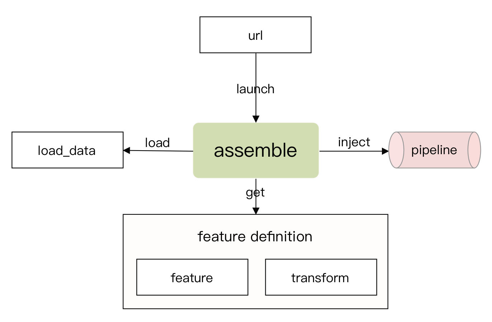

# kada

kada is an onomatopoeia, like the sound we make when building blocks.

a ligthweight feature manage framework

1. load_data: load data
2. eda process: Exploratory data analysis
3. feature definition: metadata, input data, transform
4. assemble: construct
5. validation: validate feature set after assemble
6. pipeline: use pipeline to train/test 




D-F-P

M-V-C


声明**feature url**， 然后启动**assemble**寻找**feature definition**组装成**pipeline**

## kada 框架目录结构


## kada 命令行工具生成如下目录结构

```
project
├─definition
│      feature_definition.py
│
├─eda
│      readme.md
│
├─load
│  │  load_data.py
│  │
│  └─data
└─url.py 
       
```

## kada 路由url工作
用户输入url数组，kada进行组装。


```
# 单个url过程
url -> find_module(寻找路由对应的文件位置) -> 获取其特征定义

# 堆叠pipeline
实现pipeline全局函数
pipeline([url1, url2, ...])
```

find_module支持模块下单文件的特征定定义寻找，以及多文件下的寻找
``` python 
url('f1', test.f1, name='')  # 文件下只有个feat
url('f2', test.f2, name='')  # 文件有多个feat，直接全部导入
url('f2.*', test.f2, name='')  # 同上，通过正则匹配
url('f2.', test.f2, name='')  # 匹配文件内多个feat中符合同一模式的feat
```

## tutorial

